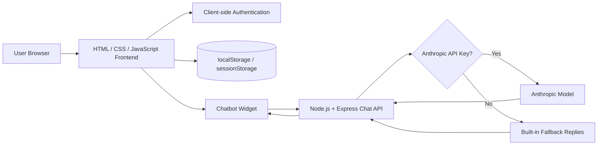
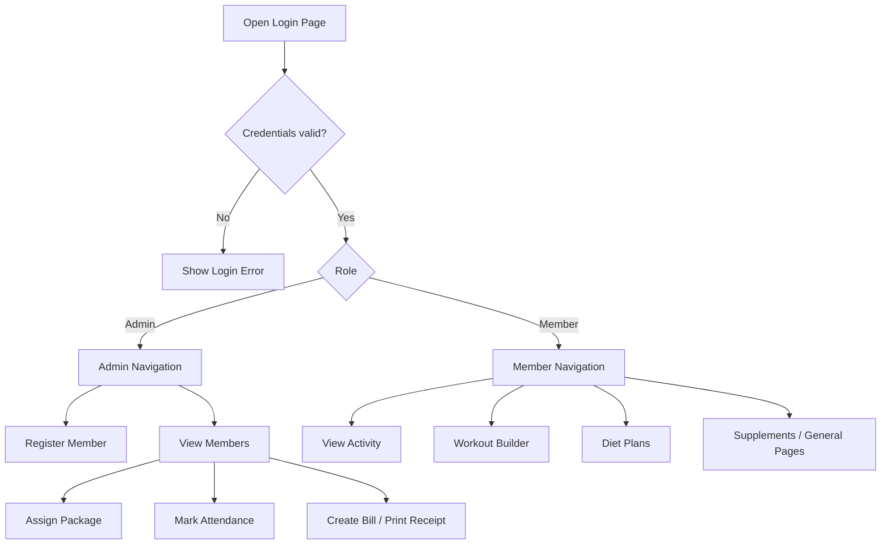
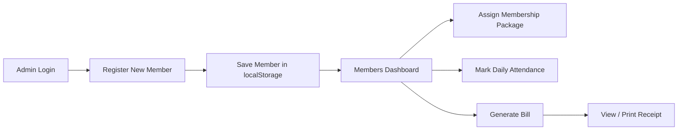
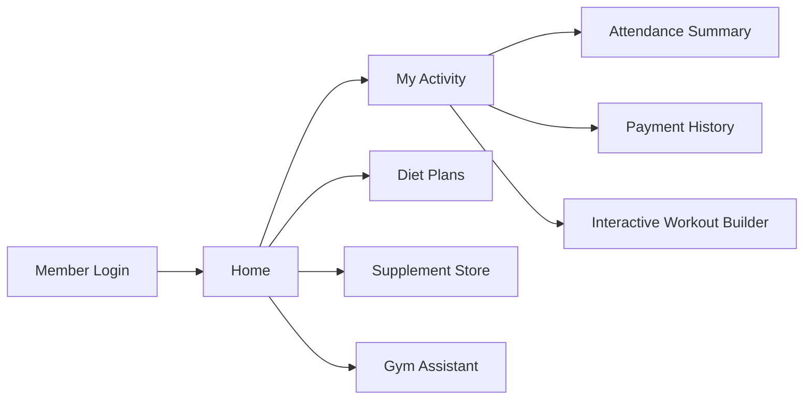
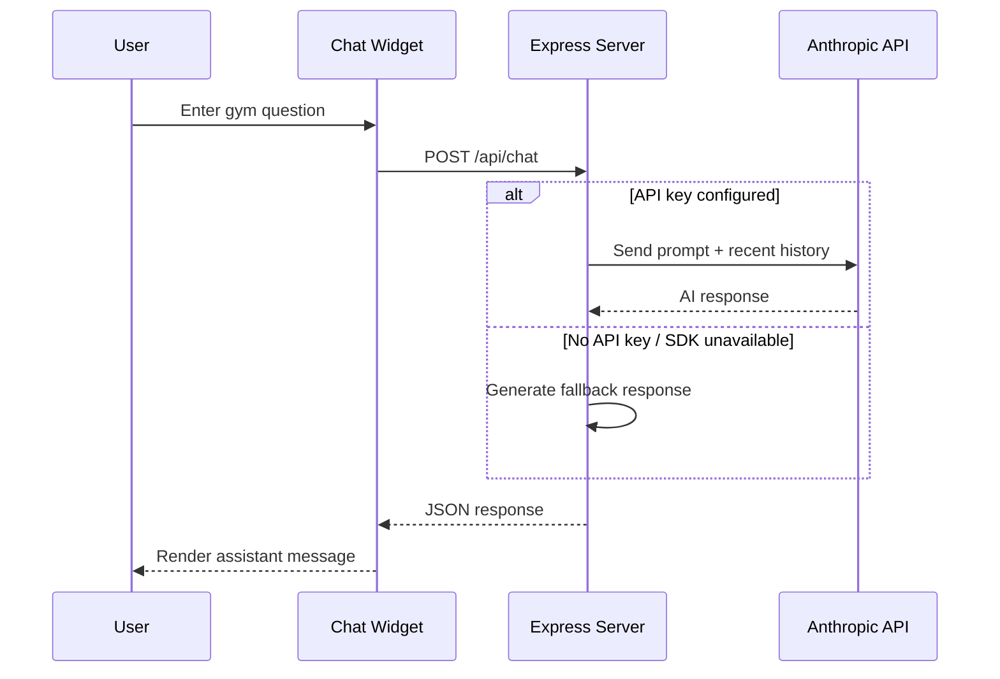
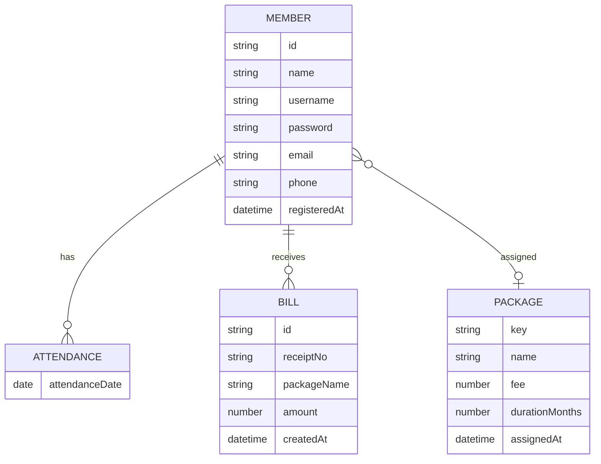
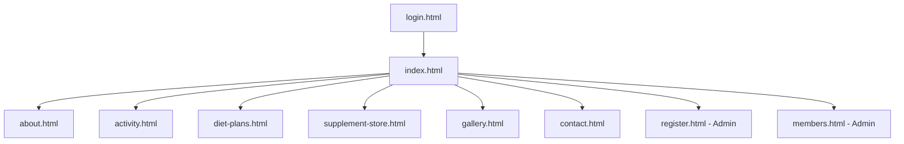
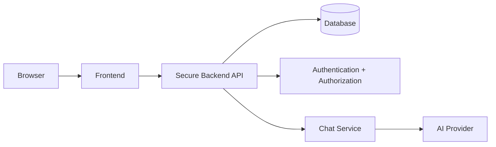

# Project Blueprint — Wellness Gym Management System

## 1. Project Goal

Build a browser-based gym management portal that allows an administrator to register and manage members while giving members access to gym information, activity history, workouts, diet guidance, and a chatbot assistant.

## 2. High-Level Architecture



## 3. Role Flow



## 4. Admin Workflow



## 5. Member Workflow



## 6. Chatbot Request Flow



## 7. Logical Data Model

The academic version stores data in the browser rather than a database.



## 8. Browser Storage Design

### `sessionStorage`

- `wellness_gym_auth` — current logged-in user/role
- `chatbot_session_id` — chatbot session identifier

### `localStorage`

- `wellness_gym_members` — members, attendance, packages, bills
- `wellness_gym_theme` — light/dark UI preference

## 9. Page Map



## 10. Module Breakdown

| Module | Main Files | Responsibility |
|---|---|---|
| Authentication | `js/auth.js`, `login.html` | Login, logout, role checks |
| Member Registration | `register.html` | Create member records |
| Admin Member Management | `members.html`, `js/members-admin.js` | Packages, attendance, bills, receipts |
| Activity | `activity.html`, `js/script.js` | Member summaries and workout UI |
| Chatbot Frontend | `js/chatbot.js`, `css/chatbot.css` | Chat widget and client requests |
| Chatbot Backend | `server/server.js` | Chat API, conversation history, AI/fallback replies |
| Common UI | `css/style.css`, `js/script.js` | Theme, animation, navigation, forms |

## 11. Core Membership Packages

| Package | Fee | Duration |
|---|---:|---:|
| Basic Monthly | Rs 1,200 | 1 month |
| Standard Monthly | Rs 1,800 | 1 month |
| Premium Monthly | Rs 2,600 | 1 month |
| Quarterly Saver | Rs 4,800 | 3 months |
| Annual Pro | Rs 16,000 | 12 months |

## 12. Deployment Blueprint

### Current academic deployment

```text
Browser
├── Static HTML/CSS/JS
├── localStorage/sessionStorage
└── Chat request → Node/Express server → Anthropic or fallback
```

### Recommended production architecture



This migration would replace browser-only storage and client-side credentials with secure server-side services.
